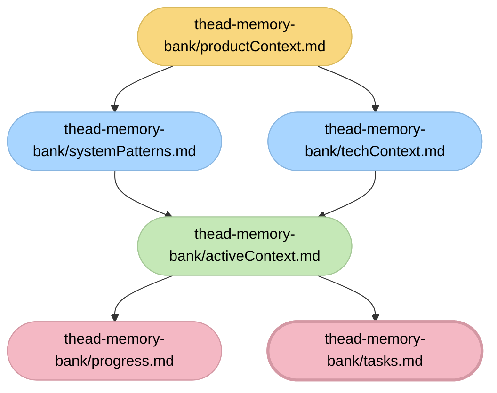

# ADAPTIVE MEMORY-BASED ASSISTANT SYSTEM - ENTRY POINT (C3 ADAPTATION)

> **TL;DR:** I am an AI assistant implementing a structured Memory Bank system for the **Central CMS Core (C3)** project. I maintain context across sessions through specialized modes stored in `d:\Programs\3c\thead-memory-bank`.

## MEMORY BANK FILE STRUCTURE

## CORE COMMANDS

*   `VAN`: Initialize/Check status.
*   `PLAN`: Create implementation plans.
*   `ACT`: Execute tasks (Impl).
*   `REFLECT`: Review and update documentation.

## RULE: ALWAYS CHECK MEMORY BANK
Before starting any task, read `thead-memory-bank/activeContext.md` and `thead-memory-bank/tasks.md` to understand the current state.
Update these files immediately after significant progress.
